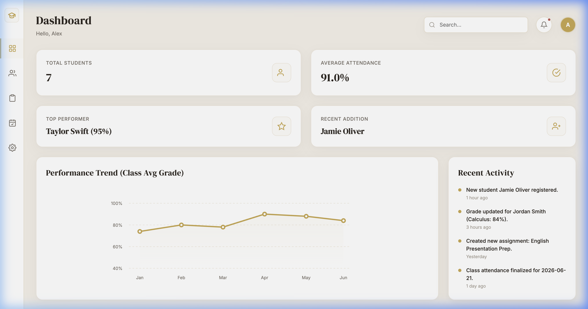
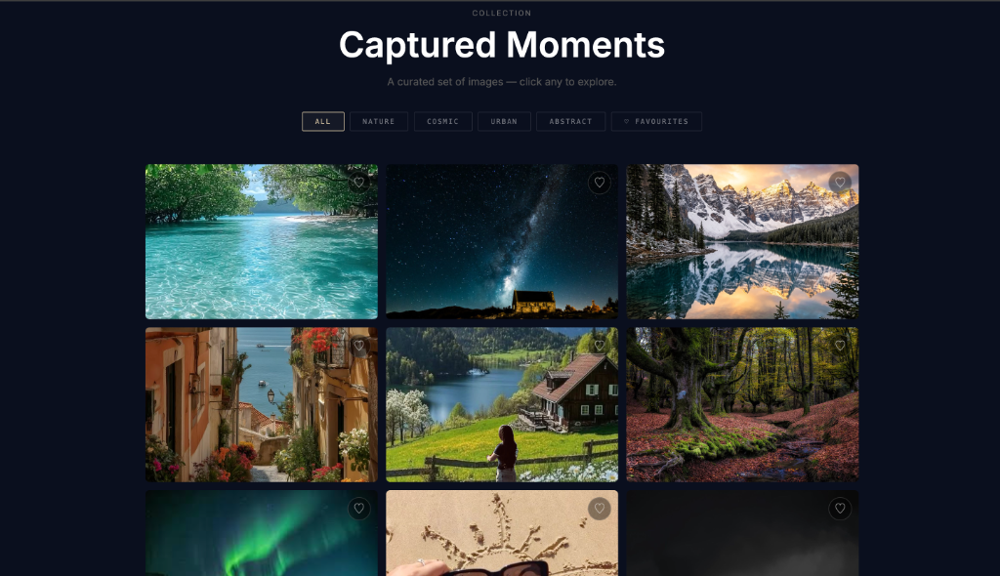

<div align="center">

# 🐝 Beeskilled Web Development Internship

### *Production-Ready Front-End Applications & Interactive Web Dashboards*

<p align="center">
  <a href="#-projects-overview"></a>
  
  
  
</p>

<p align="center">
  
  
  
  
  
  
  
</p>

</div>

---

## 📌 Internship Overview

| Parameter | Details |
| :--- | :--- |
| **Organization** | **Beeskilled** |
| **Role** | **Web Development Intern** |
| **Duration** | **26 May 2026 – 7 July 2026** |
| **Repository Scope** | Consolidated submission of all four major web development projects built during the internship tenure |

During the internship at **Beeskilled**, I developed four fully responsive, client-side web applications designed with modern visual aesthetics, rigorous component hierarchy, and zero heavy front-end UI framework dependencies. Each project emphasizes modular JavaScript architecture, clean CSS layouts, intuitive user experiences, and native browser APIs.

---

## 🚀 Projects Overview

| # | Project | Tech Stack | Live Demo | Source Directory |
|:---:|---|---|:---:|:---:|
| 1 | **Portfolio** | HTML5 · CSS3 · Vanilla JS | [🔗 View Demo](https://soumi-saha.netlify.app/) | [`Portfolio/`](./Portfolio/) |
| 2 | **Weather App** | Vanilla JS · OpenWeatherMap API · Netlify Functions | [🔗 View Demo](https://weatheringboard.netlify.app) | [`Weather-App/`](./Weather-App/) |
| 3 | **EduTrack** | HTML5 · CSS3 · Vanilla JS · LocalStorage | [🔗 View Demo](https://edutrack-sd.netlify.app/) | [`EduTrack/`](./EduTrack/) |
| 4 | **Gallery Grid** | CSS Grid · Lightbox · Touch Gestures | [🔗 View Demo](https://gallery-grid.netlify.app) | [`Gallery-Grid/`](./Gallery-Grid/) |

---

## 📂 Detailed Project Showcases

### 1. Portfolio

[](https://soumi-saha.netlify.app/)
[](./Portfolio/)

A personal developer portfolio crafted with an editorial dark aesthetic (`#000000`) and hot pink (`#FF4FA3`) accents. Showcases developer profile, academic timeline, technical skills, machine learning projects, hackathon achievements, resume viewing, and interactive contact channels.

- **Key Highlights:**
  - Dynamic typewriter animation cycling across roles and skill sets
  - Spinning gradient arc border on hero avatar
  - Glassmorphic navigation bar with scroll-spy and responsive hamburger drawer
  - Interactive project highlight cards with direct preview links
  - Native modal resume viewer and direct PDF download trigger

#### Dashboard Preview
<p align="center">
  <a href="https://soumi-saha.netlify.app/" target="_blank" rel="noopener noreferrer">
    
  </a>
</p>

---

### 2. Weather App

[](https://weatheringboard.netlify.app)
[](./Weather-App/)

A real-time worldwide weather forecasting application featuring an immersive translucent glassmorphism dashboard. Utilizes the OpenWeatherMap API coupled with a Netlify serverless function to keep API credentials secure from client exposure.

- **Key Highlights:**
  - Real-time weather search for global cities with autocomplete search history
  - Browser Geolocation API integration for 1-click local forecast
  - Metrics cards: Temperature, Feels Like, Humidity, Wind Speed, and Weather Condition
  - Dynamic background imagery from Unsplash that shifts based on real-time atmospheric conditions (Rain, Clear, Thunderstorm, Snow, Mist)
  - Unit toggle between Celsius (°C) and Fahrenheit (°F)
  - Pinned favorite locations and recent searches stored via `localStorage`

#### Dashboard Preview
<p align="center">
  <a href="https://weatheringboard.netlify.app" target="_blank" rel="noopener noreferrer">
    
  </a>
</p>

---

### 3. EduTrack

[](https://edutrack-sd.netlify.app/)
[](./EduTrack/)

A zero-dependency client-side Student Management Dashboard designed with a warm editorial aesthetic (cream canvas `#F5F0E8`, editorial gold `#C9A84C`, deep ink `#2C2620`, and DM Serif Display typography). Built as a fully functional single-page application with 5 integrated views.

- **Key Highlights:**
  - Full CRUD student record lifecycle management via accessible modal dialogs
  - Comprehensive data sorting, keyword search, and class-level filtering
  - Daily attendance roster tracker with bulk check-in capabilities
  - Assignment submission manager with dynamic circular SVG progress indicators
  - Dashboard analytics view with animated SVG line chart, stat summaries, and activity feeds
  - One-click CSV student roster export using the HTML5 Blob API
  - Live theme accent switcher and persistent application state saved to `localStorage`

#### Dashboard Preview
<p align="center">
  <a href="https://edutrack-sd.netlify.app/" target="_blank" rel="noopener noreferrer">
    
  </a>
</p>

---

### 4. Gallery Grid

[](https://gallery-grid.netlify.app)
[](./Gallery-Grid/)

A minimalist, editorial image gallery highlighting seamless transitions, cinematic hover animations, and a rich fullscreen lightbox without using any third-party UI plugins or CSS frameworks.

- **Key Highlights:**
  - Multi-breakpoint responsive CSS Grid (3-column desktop, 2-column tablet, 1-column mobile)
  - Cinematic hover effects with subtle image zoom, overlay darken, and title slide
  - Fullscreen lightbox featuring blurred backdrop grid and thumbnail navigation strip
  - Instant category filtering across Nature, Cosmic, Urban, and Abstract collections
  - Interactive favorites bookmarking persisted in `localStorage`
  - Complete keyboard navigation (Arrow navigation, Escape to close) and touch swipe gesture handling

#### Dashboard / Grid Preview
<p align="center">
  <a href="https://gallery-grid.netlify.app" target="_blank" rel="noopener noreferrer">
    
  </a>
</p>

---

## 🛠️ Technologies Used

All technologies listed below are directly implemented and verified within the repository projects:

- **Core Web:** HTML5, CSS3, JavaScript (ES6+ Vanilla)
- **Layout & Design Systems:** CSS Grid, CSS Flexbox, Glassmorphism, CSS Custom Properties (Variables), Responsive Media Queries
- **Animations & Graphics:** CSS Keyframe Animations, CSS Transitions, Inline SVG Graphics & SVG Progress Gauges
- **Browser APIs & Storage:** `Fetch API`, `localStorage API`, `Blob API`, `Geolocation API`
- **Backend & External APIs:** OpenWeatherMap REST API, Netlify Functions (Node.js Serverless Proxy)
- **Typography & Icons:** Google Fonts (`Inter`, `DM Serif Display`, `Syne`, `DM Sans`), Font Awesome 6
- **Tooling & Hosting:** Git, GitHub, Netlify CI/CD

---

## 📁 Repository Structure

```
web_dev_intern/
│
├── README.md                  # Root documentation with project directory index
├── LICENSE                    # Repository license
│
├── Portfolio/                 # Personal Portfolio Web App
│   ├── index.html
│   ├── style.css
│   ├── script.js
│   ├── assets/
│   ├── LICENSE
│   └── README.md
│
├── Weather-App/               # Real-Time Weather Dashboard
│   ├── index.html
│   ├── style.css
│   ├── script.js
│   ├── assets/
│   ├── netlify/
│   ├── netlify.toml
│   └── README.md
│
├── EduTrack/                  # Student Management Dashboard
│   ├── index.html
│   ├── style.css
│   ├── script.js
│   ├── screenshots/
│   ├── LICENSE
│   └── README.md
│
└── Gallery-Grid/              # Minimalist Image Gallery Grid
    ├── index.html
    ├── style.css
    ├── script.js
    ├── images/
    └── README.md
```

---

## ⚡ How to Run Locally

Each project is completely self-contained and requires zero complex build dependencies:

1. **Clone the repository:**
   ```bash
   git clone https://github.com/soumi-saha12/web_dev_intern.git
   cd web_dev_intern
   ```

2. **Open any project:**
   - **Portfolio:** Open `Portfolio/index.html` in your web browser.
   - **Weather App:** Open `Weather-App/index.html` in your web browser (or serve locally via VS Code Live Server / Netlify CLI).
   - **EduTrack:** Open `EduTrack/index.html` in your web browser.
   - **Gallery Grid:** Open `Gallery-Grid/index.html` in your web browser.

---

<div align="center">

*Developed with care by **Soumi Saha** during the **Beeskilled Web Development Internship**.*

[](https://soumi-saha.netlify.app)
[](https://linkedin.com/in/soumi-saha-523bba318)
[](https://github.com/soumi-saha12)

</div>
