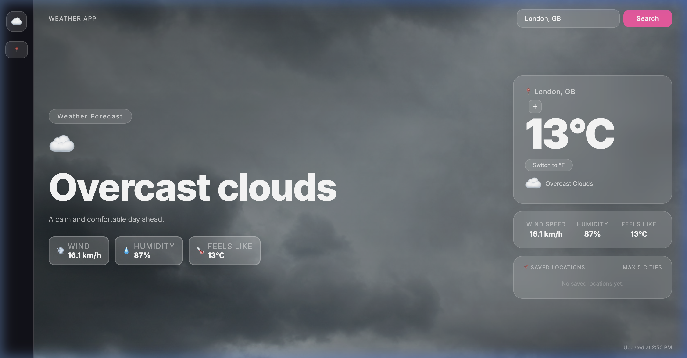
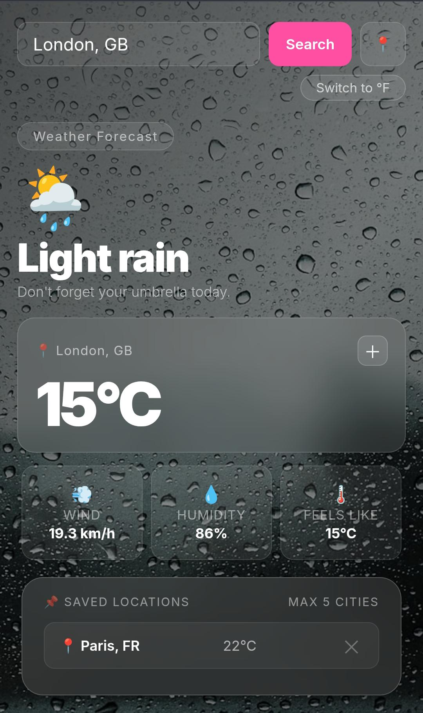

<div align="center">

# 🌧️ Weather Dashboard
### *Real-Time Weather Forecasting with a Modern Glassmorphism Experience*


<br>


<br>

🌦️ ☁️ 🌧️ ⛈️ ❄️ 🌤️

</div>

---

## ✨ Overview

Weather Dashboard is a modern weather application that provides 
real-time weather information through an immersive 
glassmorphism-inspired interface.

Built using JavaScript and the OpenWeatherMap API, the application 
combines dynamic weather visuals, responsive design, and intuitive 
interactions to create a premium user experience.

🔗 **[Live Demo](https://weatheringboard.netlify.app)**

---

## 🌟 Features

### 🔍 Search Weather Worldwide
- Search by city name
- Real-time weather retrieval
- Instant API-powered updates
- Last 3 searches saved for quick access

### 🌡️ Live Weather Metrics
- Current Temperature
- Feels Like Temperature
- Humidity Levels
- Wind Speed
- Weather Conditions

### 🎨 Dynamic Experience
- Weather-specific Unsplash backgrounds
- Modern glassmorphism cards
- Responsive design (desktop dashboard + mobile card)
- Smooth pop-up card animations on every search

### ⚡ User-Friendly Features
- °C ↔ °F Unit Toggle
- 📌 Pin up to 5 Saved Locations
- 📍 Current Location via Geolocation
- Dynamic Weather Condition Messages
- Last Updated Timestamp
- Toast notifications (no browser alerts)

### 🔒 Secure Deployment
- API key hidden via Netlify Functions
- Environment variables — key never exposed in source code

---

## 🛠️ Tech Stack

<p align="center">
  
</p>

| Technology          | Purpose                        |
| ------------------- | ------------------------------ |
| HTML5               | Structure                      |
| CSS3                | Styling & Animations           |
| JavaScript (ES6+)   | Application Logic              |
| Fetch API           | Data Retrieval                 |
| Async/Await         | Asynchronous API Calls         |
| Local Storage       | Search History & Saved Cities  |
| OpenWeatherMap API  | Weather Data                   |
| Netlify Functions   | Secure API Key Proxy           |
| Netlify Hosting     | Deployment                     |

---

## 📸 Dashboard Highlights

<div align="center">
  <h3>🖥️ Desktop View</h3>
  
  <br><br>
  <h3>📱 Mobile View</h3>
  
</div>

### 💎 Glassmorphism Design
Elegant translucent cards with depth and clarity.

### 🌧 Dynamic Weather Backgrounds
Unsplash photos adapt automatically to live weather conditions —
clear sky, rain, thunderstorm, snow, mist and more.

### 📍 Saved Locations
Pin up to 5 frequently searched cities for quick one-click access.

### 🕘 Search History
Last 3 searched cities saved — click any to instantly reload.

### 🌡 Real-Time Insights
Temperature, humidity, wind speed, and feels-like at a glance.

### 📱 Fully Responsive
Desktop shows a full immersive dashboard.
Mobile shows a compact glassmorphism dashboard layout.

---

## 🚀 Installation (Local)

```bash
git clone https://github.com/soumi-saha12/weather_app.git
cd weather_app
```

Open with VS Code Live Server:
```bash
index.html → Right click → Open with Live Server
```

---

## 🔑 API Setup (Local)

Get your free API key from:
https://openweathermap.org/api

Add your key in `script.js`:
```javascript
const API_KEY = "YOUR_API_KEY";
```

---

## ☁️ Deployment (Netlify)

This project is deployed with the API key secured via 
Netlify Functions so it is never exposed in the frontend code.

**Steps:**
1. Push repo to GitHub
2. Connect to Netlify → Import from GitHub
3. Add environment variable in Netlify dashboard:
   - Key: `OPENWEATHER_API_KEY`
   - Value: your API key
4. Deploy — Netlify auto-builds

The app fetches weather through:
```
/.netlify/functions/weather?city=Kolkata&unit=metric
```

---

## 📂 Project Structure

```
weather-dashboard/
│
├── index.html
├── style.css
├── script.js
├── netlify.toml
│
├── netlify/
│   └── functions/
│       └── weather.js
│
├── assets/
│   ├── weather-demo.gif
│   ├── images/
│   └── icons/
│
└── README.md
```

---

## 🎯 Skills Demonstrated

✨ API Integration & JSON Parsing  
✨ Async/Await & Fetch API  
✨ DOM Manipulation & Event Handling  
✨ Local Storage (history + saved cities)  
✨ Responsive Design (desktop + mobile)  
✨ UI/UX Design & Glassmorphism  
✨ Error Handling & Loading States  
✨ Secure API Proxying via Netlify Functions  
✨ Git & GitHub Version Control  
✨ Netlify Deployment  

---

<div align="center">

### 🌙 Built with code, clouds, and coffee ☕

### Made by [Soumi Saha](https://soumi-saha.netlify.app)

[](https://linkedin.com/in/soumi-saha-523bba318)
[](https://github.com/soumi-saha12)
[](https://soumi-saha.netlify.app)

</div>
